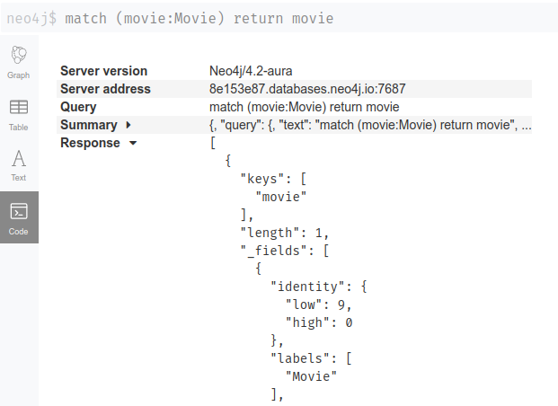

[//]: # ( ns__file unit: standard, comp: README.md )

[//]: # ( ns__custom_start beginning )

[//]: # ( ns__custom_end beginning )

[//]: # ( ns__start_section intro )

[//]: # ( ns__custom_start description )


the easy way to mock a neo4j-driver session

[//]: # ( ns__custom_end description )

[//]: # ( ns__custom_start afterDescription )

[//]: # ( ns__custom_end afterDescription )

[//]: # ( ns__custom_start badges )

[//]: # ( ns__start_section usageSection )

[](https://codecov.io/gh/YizYah/neo-forgery)
[](https://npmjs.org/package/neo-forgery)
[](https://npmjs.org/package/neo-forgery)
[](https://github.com/YizYah/neo-forgery/blob/master/package.json)

[](https://npmjs.org/package/geenee)
[](https://npmjs.org/package/ts-packrat)

[//]: # ( ns__custom_end badges )

[//]: # ( ns__end_section intro )


[//]: # ( ns__start_section api )


[//]: # ( ns__custom_start APIIntro )

# Why
I couldn't find any other straightforward way to mock the neo4j driver during unit tests. It needs to be super fast and simple to work with CI and TDD.

# What
A mock session generator for neo4j.  You set up the session info, which consists of query strings, param objects, and expected responses.

You can pass it in as a parameter to a function to test instead of a real session.

# Usage

Include the package in dev:
```
npm i -D neo-forgery
```
Then create a mock session generator:
```
const getMockSession = require('neo-forgery')
```

Mocking takes 3 steps:
1. [specify the precise query and result info](#specifying-query-and-result-info) for neo4j
2. [create your session info](#creating-session-info)
3. [declare a session and call `run` as needed](#run-your-queries)

## Specifying Query and Result Info
You will have to define the session info by copying expected queries, params, and results from your neo4j browser.

Following is an example.  Say that in neo4j you create data as follows:
```
merge (a:Movie {name: "Star Wars: Episode VII"})-[:RELEASED_IN]->(y:Year {value: 2015})<-[:RELEASED_IN]-(b:Movie {name: "Jurassic World"})
merge (c:Movie {name: "The Lion King"})-[:RELEASED_IN]->(z:Year {value: 2019})
return a,b,c,y,z
```

You can then mock calling the query `match (movie:Movie) return movie` two times.  You will have to get your expected results from the queries to insert into your test.  One way is to run the query in your neo4j data browser and grab the results:


Let's assume that between the first and second time you expect `Jurassic World` to be removed, e.g.
```
match (movie:Movie {name: "Jurassic World"}) detach delete movie
```

Here is sample test code declaring the info about the query to test and expected results:
```
const query='match (movie:Movie) return movie'
const params={}
const expectedResult = [
  {
    "keys": [
      "movie"
    ],
    "length": 1,
    "_fields": [
      {
        "identity": {
          "low": 9,
          "high": 0
        },
        "labels": [
          "Movie"
        ],
        "properties": {
          "name": "Star Wars: Episode VII"
        }
      }
    ],
    "_fieldLookup": {
      "movie": 0
    }
  },
  {
    "keys": [
      "movie"
    ],
    "length": 1,
    "_fields": [
      {
        "identity": {
          "low": 11,
          "high": 0
        },
        "labels": [
          "Movie"
        ],
        "properties": {
          "name": "Jurassic World"
        }
      }
    ],
    "_fieldLookup": {
      "movie": 0
    }
  },
  {
    "keys": [
      "movie"
    ],
    "length": 1,
    "_fields": [
      {
        "identity": {
          "low": 12,
          "high": 0
        },
        "labels": [
          "Movie"
        ],
        "properties": {
          "name": "The Lion King"
        }
      }
    ],
    "_fieldLookup": {
      "movie": 0
    }
  }
]

const secondExpectedResult = [
  {
    "keys": [
      "movie"
    ],
    "length": 1,
    "_fields": [
      {
        "identity": {
          "low": 9,
          "high": 0
        },
        "labels": [
          "Movie"
        ],
        "properties": {
          "name": "Star Wars: Episode VII"
        }
      }
    ],
    "_fieldLookup": {
      "movie": 0
    }
  },
  {
    "keys": [
      "movie"
    ],
    "length": 1,
    "_fields": [
      {
        "identity": {
          "low": 12,
          "high": 0
        },
        "labels": [
          "Movie"
        ],
        "properties": {
          "name": "The Lion King"
        }
      }
    ],
    "_fieldLookup": {
      "movie": 0
    }
  }
]
```

## Creating Session Info

Next, you must specify `sessionInfo`.  (If you are using TypeScript, then you can import the `SessionInfo` type interface from the project.)  A `SessionInfo` is an object with the queries as keys.  Each query has as its value an array of objects.  The objects contain:
* params: an object with the parameters sent with the query (see [neo4j-driver](https://www.npmjs.com/package/neo4j-driver) for more information)
* an array of anticipated responses.

  **_Note_** `responses` for a given query and parameters is an array.  If there is only one element, then every time you run the query with the same parameters you will get back the same result.  But, if you have multiple elements, `neo-forgery` assumes that you want to get different responses each time it runs.  So if you have only 2 elements, and you run it 3 times, the third time will result in an error.  But if you have only one element in `responses`, you can run the query repeatedly without generating an error.

Here is an example of a `sessionInfo` created from the above query and result data:
```
import {SessionInfo} from 'neo-forgery'
const sessionInfo: SessionInfo = {
  [query]: [
      {
        params,
        responses: [
          expectedResult,
          secondExpectedResult
        ]
      }
  ]
}
```

# Run your Queries
Once you have a `sessionInfo`, you can declare a session, and your code should work:

```
  const session = getMockSession(sessionInfo)
  let result = session.run(query, params)
    // result will be deeply equal to expectedResult
  let result = session.run(query, params)
    // result will be deeply equal to secondExpectedResult
});

```

# Errors
`neo-forgery` assumes that the test should fail if anything unexpected occurs. You should receive an error if, for instance:

* you call a query that does not exist in your session info
* you call a query with params that do not exist for that query in your session info
* you are missing `responses`
* your `responses` array is empty
* you make more than the number of calls for which you have `responses` (but only if you have more than a single response listed.  See the note above.)

# Limits
1. This package will not help you to test a section of code where you explicitly declare a session using neo4j-driver.  Rather, it helps when you can pass in a session as a parameter.

  That is a limitation, but arguably it is better style anyway to pass in a session as an argument. Doing so isolates entirely the session and database info from the queries being performed.

2. The optional `config` parameter for a `Session.run()` is not supported currently.

[//]: # ( ns__custom_end APIIntro )

[//]: # ( ns__custom_start constantsIntro )
[//]: # ( ns__custom_end constantsIntro )


[//]: # ( ns__start_section types )


[//]: # ( ns__end_section types )


[//]: # ( ns__end_section api )

