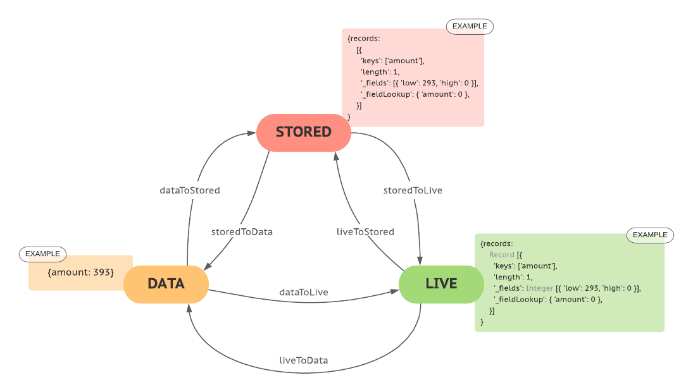
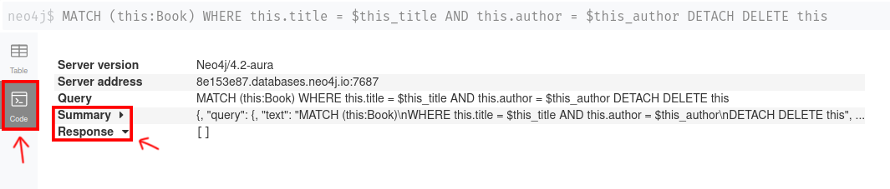


[//]: # ( ns__file unit: standard, comp: README.md )

[//]: # ( ns__custom_start beginning )

[//]: # ( ns__custom_end beginning )

[//]: # ( ns__start_section intro )

[//]: # ( ns__custom_start description )


the easy way to mock a neo4j-driver session.

[//]: # ( ns__custom_end description )

[//]: # ( ns__custom_start afterDescription )

[//]: # ( ns__custom_end afterDescription )

[//]: # ( ns__custom_start badges )

[//]: # ( ns__start_section usageSection )

[](https://codecov.io/gh/YizYah/neo-forgery)
[](https://npmjs.org/package/neo-forgery)
[](https://npmjs.org/package/neo-forgery)
[](https://github.com/YizYah/neo-forgery/blob/master/package.json)

[](https://npmjs.org/package/geenee)
[](https://npmjs.org/package/ts-packrat)

[//]: # ( ns__custom_end badges )

[//]: # ( ns__end_section intro )


[//]: # ( ns__start_section api )


[//]: # ( ns__custom_start APIIntro )

[//]: # ( ns__custom_start toc )
<!-- toc -->
* [:clipboard: Why](#clipboard-why)
* [:white_check_mark: What](#white_check_mark-what)
* [:wrench: Usage](#wrench-usage)
* [:symbols: Formats for Query Responses](#symbols-formats-for-query-responses)
* [:key:Functions](#key-functions)
* [:paperclip: Data Types](#paperclip-data-types)
* [:heavy_exclamation_mark: Limits](#heavy_exclamation_mark-limits)
* [:blue_book: Tutorial](#blue_book-tutorial)
* [:thumbsup: Credits](#thumbsup-credits)
<!-- tocstop -->

[//]: # ( ns__custom_end toc )

# <a name="clipboard-why"></a>:clipboard: Why
I couldn't find any other straightforward way to mock the neo4j driver during unit tests. It needs to be super fast and simple to work with CI and TDD.

# <a name="white_check_mark-what"></a>:white_check_mark: What
A mock session generator for neo4j.  You set up a mock neo4j session by specifying an array of query spec objects.  Each query spec object contains a query string, param set, and expected response.

You can then pass in your mock session as a parameter to a function to test instead of a real session. It works for both running queries directly (`session.run(...)`) and transactions (`session.readTransaction()` and `session.writeTransaction()`). You also can generate a mock driver, build your server using it rather than the real driver, and mock all of the queries in the server.

There is also a function to test a query set against the live database, not intended for unit tests.  That way, whenever you change your database you can confirm that the queries in your mock session are all still working!

# <a name="wrench-usage"></a>:wrench: Usage

Include the package in `dev`:
```
npm i -D neo-forgery
```

### Mocking a Query
To mock a query, simply:
1. capture the result from the query. For instance, if you call the query in your code already with a `console.log` statement:
     ```
        (result: any) => {
           console.log(`result=${JSON.stringify(result)}`)
           ...
        }
     ```

     Or you can run the query in the neo4j data browser, then on the left click the `Code` button and copy the `Response`:.

    

    __*NOTE*__ If you copy from the data browser, you'll only get the `records` portion of the output.  You'll have to paste it in as a value for `records`  in an object:
    ```
    {
        records: <Response>
    }
    ```

2. copy and store the output as a const using the `wrapCopiedResults()` helper function, e.g.:
    ```
    import {wrapCopiedResults} from 'neo-forgery'
    
    const sampleOutput = wrapCopiedResults: [{ ... } ... ]
    ```
3. Create an array of `QuerySpec` and insert your query string, params, and output.  Here's an example in TypeScript using the [sample movies database](https://neo4j.com/developer/example-project/#_existing_language_driver_examples).

    ```
    import {QuerySpec, mockSessionFromQuerySet} from 'neo-forgery'
    
    const querySet:QuerySpec[] = [
        {
            name: 'movies',
            query: 'MATCH (movie:Movie)' +
                ' WHERE toLower(movie.title) CONTAINS $query' +
                ' RETURN movie',
            output: expectedResultForMovieQuery,
            params: {query:"matrix"}
        },
        {
            name: 'title',
            query: 'MATCH (movie:Movie {title:$title}) ' +
                'OPTIONAL MATCH (movie)<-[rel]-(person:Person) ' +
                'RETURN movie.title as title, ' +
                'collect({name:person.name, role:rel.roles, job:head(split(toLower(type(rel)),\'_\'))}) as cast ' +
                'LIMIT 1',
            params: {title: 'Apollo 13'},
            output: expectedResultsForTitleQuery,
        }
    ]
    ```

4. generate a mockSession that returns it using `mockSession`.  You can then call `mockResultsFromCapturedOutput` to generate a true neo4j array of the Record type to compare the expected output to what your mock session returns.
    ```
        const session = mockSessionFromQuerySet(querySet)
        const output = await session.run(query, params)
        t.deepEqual(output,storedToLive(expectedOutput))
    ```

You can pass your mock session into code that requires a session.

An alternative is `dataToStored`, which takes as input an array of objects containing record values.  That can be useful if you know what data you want, and did not copy the Results from the data browser or from a `console.log` statement.

## <a name="symbols-formats-for-query-responses"></a> :symbols: Formats for Query Responses
The actual responses to queries differ from the stored ones in that the response include object class instances rather than simple jsons.  In addition, what gets returned from GraphQL shows pure data, which differs in some ways from even the stored format for queries.

Therefore, it is important to understand that when you want to deep-compare a query result to a stored expected result you must convert one of them to be in the same format as the other.  Also, you may want to store a pure data representation of a query and to compare it with actual results.  Therefore, neo-forgery maintains three formats for query results, and provides conversion functions among them:

1. **stored** a json representing a response. Looks identical to a console.log of an actual response.
2. **live** the object returned from an actual query, including instances of the `Record` class.  Also represents integers as instances of the `Integer` class.
3. **data** simple objects, like what GraphQl Returns.  Roughly what you see in the neo4j data browser results when you select the `TABLE` view.  
  




To convert from format `A` to `B` from the list of 3 above, you call `AToB`, e.g. using AVA you might have this: 
```
import {mockSessionFromQuerySet, storedToLive} from 'neo-forgery'

const session = mockSessionFromQuerySet(querySet)
   
const output = await session.run(query, params)
        
t.deepEqual(output,storedToLive(expectedOutput))
 
```

---
#### A Note About Integers
neo4j supports a greater range of integers than Javascript.  Therefore, the [neo4j-driver documentation](https://github.com/neo4j/neo4j-javascript-driver#numbers-and-the-integer-type) explains that the driver query results do not return a simple number, because then data would potentially be lost.  Instead, the driver returns a special object with `low` and `high` stored for the number. The neo-forgery conversions support that.  But your mock results __*must not use integers that exceed the safe range for Javascript*__.  That allows you anything between -(2^53 - 1) and (2^53 - 1).  In the unlikely event that real data has larger numbers, you may have to reduce them in your stored mock results.

In addition, neo-forgery assumes that data with the following format represents an integer:
```
{
  low: <Integer Value>,
  high: 0
}
```
In the extraordinarily unlikely event that you have an object in your data that just happens to match that expression, the `liveToData` and `storedToData` functions will wrongly convert it to the integer value for `low`.

---


## <a name="key-functions"></a>:key: Functions
### Mock Results Generation
There are two functions for generating mock output.  These can be used for confirming that output is what you expect it to be.

### Mock Session Generation
The main function for generating a mock session is:
```
mockSessionFromQuerySet
```
You pass in a QuerySet and an instance of a neo4j `Session` is returned.

But, if you need more precision, or if for whatever reason you want to create your own custom mock session, you can use this:
```
mockSessionFromFunction(sessionRunMock: Function)
```
Pass in a Function and a session is generated.

The `sessionRunMock` function should have as parameters `(query: string, params: any)`, and should normally return mock results.  You can use the result conversion functions `dataToLive` and `storedToLive` for the returned values.  You can also vary the output from the function based upon the query and params received. 

In theory, you could create a session which emulates your entire database for all of the queries in your tests, and simply reuse the mock session in all of your tests.  Note that you can also throw errors if you are testing for them. 

### Mock Driver Generation
There are cases where you will have to generate a mock driver.  The most typical use case is for mocking an Apollo Server that uses the [@neo4j/graphql](https://www.npmjs.com/package/@neo4j/graphql) library.

The following function can be used:
```
mockDriver(session: Session, databaseInfo?: DatabaseInfo)
```
* `session` can be generated using either of the [Mock Session Generation Functions](#mock-session-generation) above.
* You probably don't need to specify anything about a real database.  But if you want the proper info stored for the driver you can generate `databaseInfo` is generate using the utility function [getDatabaseInfo](#getdatabaseinfo), e.g.:
 ```
 const databaseInfo = getDatabaseInfo(
   process.env.URI,
   process.env.USER_NAME,
   process.env.PASSWORD
 )
 ```
You can insert your `driver` into a `context` used with `ApolloServer`, e.g.:
```
function context({ event, context }: { event: any, context: any }): any {
  return ({
    event,
    context,
    driver,
    user,
    cypherParams,
  });
}

const server = new ApolloServer(
  {
    schema,
    context,
    cors: {
      origin: '*',
      methods: 'GET,HEAD,POST',
    },
    introspection: true,
  });
```
Then you can include calls inside of your session.

__*Note*__: when you use `@cypher` directives, the [@neo4j/graphql](https://www.npmjs.com/package/@neo4j/graphql) library will augment your query text as well as your parameters. So the first time the query will probably fail.  But neo-forgery automatically tells you clearly how you need to change both the queries and the parameters to be able to match. So you can just copy the proper values and replace your own.

Another usage of your driver is overriding `driver` in code that uses one.  You can use [proxyquire](https://www.npmjs.com/package/proxyquire) or whatever tool you'd like to stub out the definition of `driver` in your code and replace it with `mockDriver`.
  
    ```
    const { myUnit } = proxyquire('../src/myUnit', {
      'neo4j-driver': { 'driver': mockDriver },
    });
    ```

### Formatting Functions
As detailed [above](#formats), here are the functions for converting results to different formats:

* `dataToLive(data: object[]): LiveResponse`
* `dataToStored(data: object[])`
* `storedToData(storedResponse: StoredResponse): object[]`
* `storedToLive(storedResponse: StoredResponse): LiveResponse`
* `liveToStored(liveResponse: LiveResponse): StoredResponse`
* `liveToData(liveResponse: LiveResponse): object[]`

Note that there is metadata in a `LiveResonse`, which has the key `summary`.  The metadata is lost if you call `storedToData` or `liveToData`. 

An additional function that is helpful when you copy from the neo4j data browser is
 ```
wrapCopiedResults(copiedResponse: StoredRecord[], copiedSummary: any): StoredResponse
```
It simply generates the proper stored format for a response, using the records("Response") and optional metadata("Summary") copied from the `CODE` options:



Usually, you probably won't need the summary.  But, if you happen to need a stat such as `nodesDeleted` you can copy the summary as well.  

Here's a sample usage when all you need is the records: 
```
const expectedOutput = wrapCopiedResults(<Response array of records copied from the browser>)
```

Here's an example of a needed summary usage (say you deleted nodes, so you have no resulting records returned):
```
const expectedOutput = wrapCopiedResults([], <Summary object copied from the browser>)

```

### getDatabaseInfo
If you like, you can make the database info for a driver the real info for your database.  Doing so will not affect the performance of the mock driver, but the data in the driver instance will show the real database info.
```
export function getDatabaseInfo(
  uri?: string,
  user?: string,
  password?: string,
  database?: string,
)
```
You can insert the information that you need.  Usually you won't need it.

Here's an example usage based upon an `.env` file:
```
require('dotenv').config();
import { getDatabaseInfo } from 'neo-forgery';

const databaseInfo = getDatabaseInfo(
  process.env.URI,
  process.env.USER_NAME,
  process.env.PASSWORD
)
```

### Verification of Your Mock Query Results
One last function is
```
testQuerySet(querySet: QuerySpec[], databaseInfo: DatabaseInfo)
```
See [Checking the Validity of Your Mocked Queries](#checking-the-validity-of-your-mocked-queries) below.

## <a name="paperclip-data-types"></a>:paperclip: Data Types
There are some interfaces that you can import into your TypeScript project.

### Database Specification
You must use a DatabaseInfo type for specifying the database that you want to use for running [testQuerySet](#checking-the-validity-of-your-mocked-queries).
```
interface DatabaseInfo {
  URI: string;
  USER: string;
  PASSWORD: string;
  DATABASE?: string;
}
```

### Query Response Specification 
The output from a query is specified via a `MockOutput` instance:
```
interface MockOutput {
    records: SampleOutputRecord[];
    summary?: any;
}
```
Normally, you won't need to worry about the details for that.  You can just capture the output in the ways specified [above](#mocking-a-query).

### Query Specifications
A query set is an instance of `QuerySpec[]`:
```
export interface QuerySpec {
    name?: string;
    query: string;
    output: MockOutput;
    params?: ParamSet;
}
```

### Checking the Validity of Your Mocked Queries
The `neo-forgery` package is build based on the premise that unit tests must be fast.  By removing the need to query an actual database, you get instant results.  But what if your database changes and the queries no longer work?

To solve that problem, `neo-forgery` exports a function:
```
async function testQuerySet(querySet: QuerySpec[], databaseInfo: DatabaseInfo)
```
You can pass in your set of queries along with the information needed for a database, and you can check whether the queries work for the given database.  If any of them fail to return what you specify as output, and error is returned.

For example:
```
import { DatabaseInfo, testQuerySet } from 'neo-forgery'
const moviesDatabaseInfo: DatabaseInfo = {
  URI: 'neo4j+s://demo.neo4jlabs.com',
  USER: 'movies',
  PASSWORD: 'movies',
  DATABASE: 'movies',
};

const queriesWorking = await testQuerySet(querySet, moviesDatabaseInfo)
t.is(queriesWorking, "success")  
```

This function is *not intended for unit tests*! The whole point of `neo-forgery` is to remove the need to query an actual database when you run your unit tests.  Rather, consider creating a separate test that you call regularly, perhaps as part of a regression test or after you change your database.

__*NOTE*__ Currently, `testQuerySet()` currently checks only `records` in query results, and only makes an exact match.  For instance, it will throw an error even the your `output` for a query is a subset of the data returned.  That is a problem if you want to create small sample outputs for testing purposes.  A future version of `neo-forgery` may remove that limitation by allowing you to specify a type of comparison for a query.


# <a name="heavy_exclamation_mark-limits"></a>:heavy_exclamation_mark: Limits
Some limits to neo-forgery are intentional. There's no testing of data updates, because it should not be relevant to unit tests.  You are not testing the database server, or even the queries themselves.  A query is just a string from the standpoint of your unit, and your unit tests should assume that the response is predictable and unchanging.  An end to end test can confirm that independently.  The most that you might need from the standpoint of unit testing is to confirm that a write query was executed, which you can do with a [sinon spy](https://sinonjs.org/releases/latest/spies/).

But `neo-forgery` is new, and there still are things that it should be able to do that have not yet been implemented.

1. Currently, you can't have more than one result in a given mock session for a given query and parameter combination.  That's limiting, because you might have a sequence that queries for something, changes it, and queries for the new value.  For instance, your unit may check whether someone has a registered email, and if it's not there you may add it and then confirm that it is there and proceed with further steps based on that output. There is a planned implementation fixing that problem.
2. The optional `config` parameter for a `Session.run()` is not supported currently. Much of the config may be irrelevant to unit testing, so that will probably be implemented only as requested.
3. See the [note about integers](#a-note-about-integers) above.

# <a name="blue_book-tutorial"></a>:blue_book: Tutorial
Check out this [tutorial to create a project and test](https://medium.com/neo4j/how-to-mock-neo4j-calls-in-node-7066c52ac468).


# <a name="thumbsup-credits"></a>:thumbsup: Credits
Special thanks goes to some people at [neo4j](https://neo4j.com/) for helping me with this.  

:thumbsup: First and foremost to [Antonio Barcélos](https://github.com/bigmontz) on the [neo4j-driver](https://github.com/neo4j/neo4j-javascript-driver) team for the working solution for mocking a transaction.

:thumbsup: Thanks also to [Darrell Warde](https://github.com/darrellwarde) and [Dan Starns](https://github.com/danstarns) on the [@neo4j/graphql](https://github.com/neo4j/graphql) team for some very helpful advice.

[//]: # ( ns__custom_end APIIntro )

[//]: # ( ns__custom_start constantsIntro )
[//]: # ( ns__custom_end constantsIntro )


[//]: # ( ns__start_section types )


[//]: # ( ns__end_section types )


[//]: # ( ns__end_section api )

